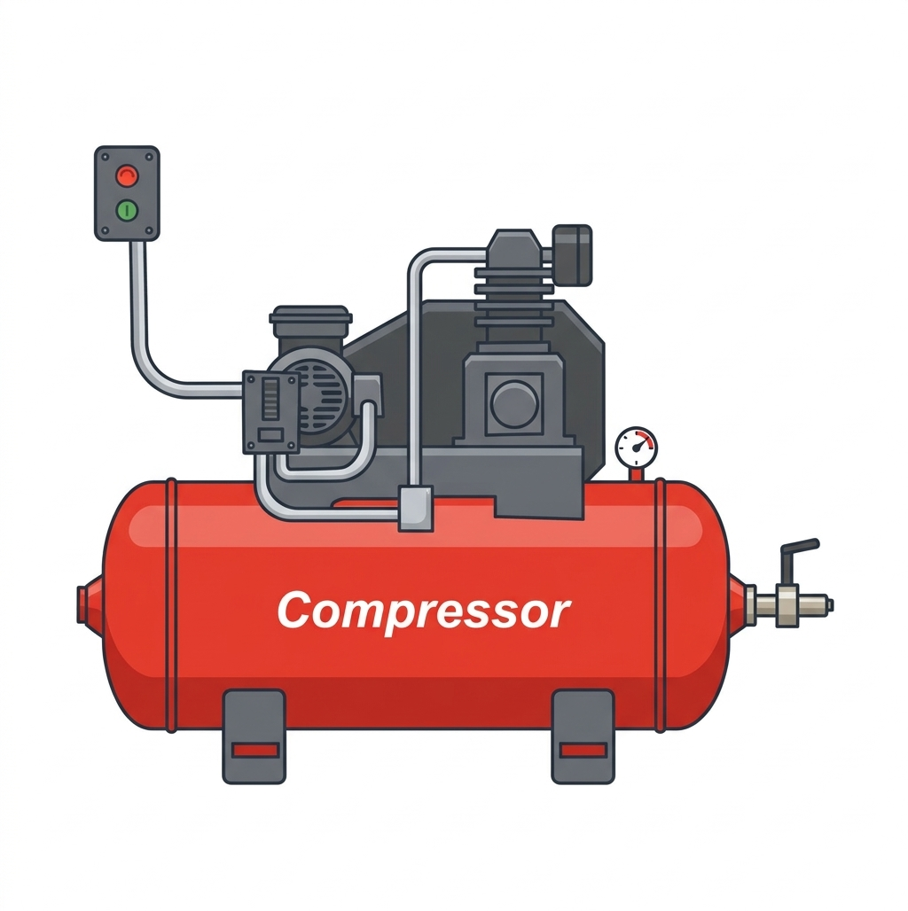

  

<h1 align="center">KIVO</h1>

<strong>Offline compressor for videos, images and PDFs</strong>

  
  
  

---

## What is KIVO?

KIVO is a file compression app that runs entirely on your device — **no internet, no servers, no file uploads**.

Your files never leave your machine. All compression happens locally using FFmpeg (video) and native algorithms (images and PDFs) bundled inside the app.

---

## Supported formats

| Type   | Accepted formats                   |
|--------|------------------------------------|
| Video  | MP4, MOV, M4V, AVI, MKV, WEBM     |
| Image  | JPG, JPEG, PNG, WEBP, HEIC, HEIF  |
| PDF    | PDF                                |

---

## How to use

1. **Select a file** — tap _Select File_ and pick the file you want to compress
2. **Compress** — tap _Compress_ and wait for the progress bar to complete
3. **Save anywhere** — choose the destination folder when prompted

That's it. No sign-up, no configuration, no internet required.

---

## Compression examples

Results vary depending on the file content, but here are real-world examples achieved with KIVO:

### Video
| Original file  | After compression | Reduction |
|---------------|-------------------|-----------|
| 68.8 MB (MOV) | 39.9 MB           | **−42%**  |
| 120 MB (MP4)  | ~55 MB            | **~−54%** |

> KIVO uses FFmpeg with H.264/HEVC codec and smart bitrate adjustment, balancing visual quality with final file size.

### Image
| Original file  | After compression | Reduction |
|---------------|-------------------|-----------|
| 4.2 MB (PNG)  | 1.1 MB            | **−74%**  |
| 800 KB (JPG)  | 310 KB            | **−61%**  |

> Images are re-encoded as JPEG with optimized quality settings, stripping unnecessary metadata.

### PDF
| Original file  | After compression | Reduction |
|---------------|-------------------|-----------|
| 7.6 MB (PDF)  | 3.2 MB            | **−58%**  |
| 2.1 MB (PDF)  | 900 KB            | **−57%**  |

> PDFs are rasterized page by page and re-encoded with efficient image compression.

---

## Why is it safe?

- **100% offline** — the app never accesses the internet
- **No account, no login** — zero personal data collected
- **Local processing** — your files never leave your device
- **Open source** — you can inspect exactly what the app does

This makes KIVO ideal for compressing confidential documents, personal videos, or any file you would rather not send to the cloud.

---

## Platforms

| Platform | Status                             |
|----------|------------------------------------|
| macOS    | ✅ Supported                        |
| Windows  | ✅ Supported                        |
| Linux    | ✅ Supported                        |
| Android  | ✅ Supported                        |
| iOS      | ✅ Supported (physical device)      |

> **iOS:** video compression requires a physical device. Images and PDFs work normally on the simulator.

---

## Download

Visit the [releases page](https://github.com/eltonccdantas/kivo/releases) and download the build for your operating system.

| OS       | File                     |
|----------|--------------------------|
| macOS    | `kivo-macos.zip`         |
| Windows  | `kivo-windows.zip`       |
| Linux    | `kivo-linux-x64.tar.gz` |
| Android  | `kivo-android.apk`       |

---

## Tech stack

- **Flutter** — cross-platform UI
- **FFmpeg** — video compression (bundled, no external dependencies)
- **Dart `image`** — image compression
- **`printing` + `pdf`** — PDF compression

---

  eltondantas.com &nbsp;=)

